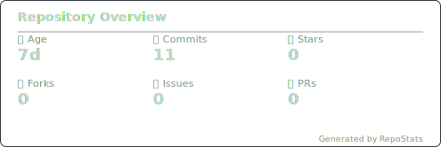
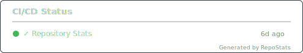
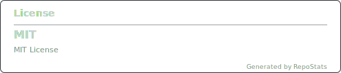
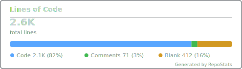
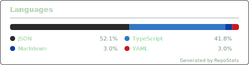
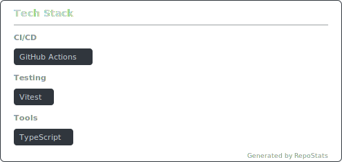
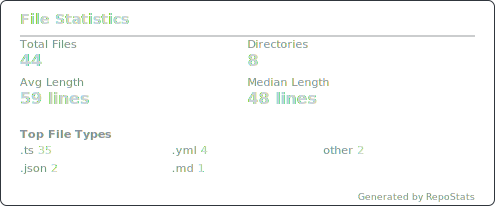
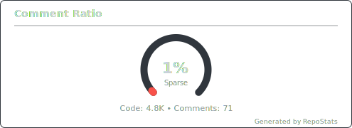
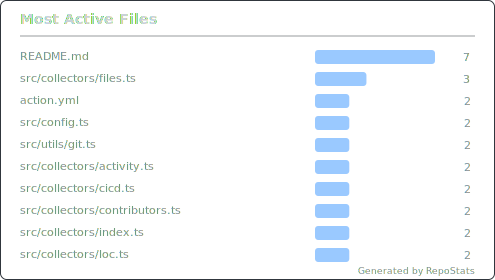

# RepoStats

Generate beautiful SVG stat cards for your GitHub repository with a single GitHub Action.

## Features

- 11 stat cards covering every aspect of your repo
- 4 built-in themes (dark, light, dimmed, high-contrast) + custom theming
- Pure TypeScript — no heavy dependencies, <1.5MB bundle
- Single-pass file analysis for maximum performance
- Graceful degradation — individual card failures don't crash the action
- Auto-updates your README with embedded SVG cards

## Cards

| Card | What it shows |
|------|--------------|
| **Repo Overview** | Age, commits, stars, forks, issues, PRs |
| **Commit Activity** | Weekly commit sparkline over the past year |
| **Contributors** | Top 8 contributors with avatars |
| **CI/CD Status** | Latest workflow run results |
| **License** | License type badge |
| **Lines of Code** | Code/comment/blank breakdown with stacked bar |
| **Languages** | Language breakdown with GitHub-style bar |
| **Tech Stack** | Detected frameworks, databases, infra, CI, tools |
| **File Stats** | File/dir counts, avg/median file length, top types |
| **Comment Ratio** | Code-to-comment ratio gauge |
| **Most Active Files** | Files with most commits |

## Quick Start

Add this workflow file to your repository:

```yaml
# .github/workflows/repostats.yml
name: Repository Stats
on:
  push:
    branches: [main]
  schedule:
    - cron: '0 0 * * 0'
  workflow_dispatch:
permissions:
  contents: write
jobs:
  stats:
    runs-on: ubuntu-latest
    steps:
      - uses: actions/checkout@v4
        with:
          fetch-depth: 0
      - uses: SolutionSpacePL/repostats@v1
        with:
          github_token: ${{ secrets.GITHUB_TOKEN }}
```

That's it! The action will:
1. Analyze your repository
2. Generate SVG cards in `.repostats/`
3. Insert/update a stats section in your README
4. Commit and push the changes

## Configuration

### Action Inputs

| Input | Default | Description |
|-------|---------|-------------|
| `github_token` | `${{ github.token }}` | GitHub token for API access |
| `cards` | `all` | Comma-separated card list or `all` |
| `theme` | `dark` | Theme: `dark`, `light`, `dimmed`, `high-contrast` |
| `output_dir` | `.repostats` | Directory for generated SVGs |
| `readme_path` | `README.md` | Path to README file |
| `config_file` | `.repostats.yml` | Path to config file |
| `exclude` | `node_modules,vendor,.git,dist,build` | Patterns to exclude |
| `max_files` | `50000` | Max files to analyze |
| `columns` | `2` | README layout columns (1 or 2) |

### Config File

For more options, create a `.repostats.yml` in your repo root. See [examples/repostats.yml](examples/repostats.yml) for all options.

## Themes

### Dark (default)
Cards use GitHub's dark theme colors.

### Light
Clean white background with GitHub's light theme.

### Dimmed
Softer dark theme, easier on the eyes.

### High Contrast
Maximum contrast for accessibility.

### Custom
Override any theme variable in `.repostats.yml`:

```yaml
theme: dark
custom_theme:
  bg: '#1a1b27'
  text: '#a9b1d6'
  accent: '#7aa2f7'
  border: '#3b4261'
  barColors:
    - '#7aa2f7'
    - '#9ece6a'
    - '#e0af68'
    - '#f7768e'
```

## Selecting Cards

Generate only specific cards:

```yaml
- uses: SolutionSpacePL/repostats@v1
  with:
    cards: repo-overview,language-breakdown,tech-stack
```

Available card types: `repo-overview`, `commit-activity`, `contributors`, `cicd-status`, `license`, `loc-summary`, `language-breakdown`, `tech-stack`, `file-stats`, `comment-ratio`, `active-files`

## Tech Stack Detection

RepoStats detects 80+ technologies by scanning manifest files:

- **package.json** — React, Next.js, Vue, Angular, Express, Prisma, Jest, etc.
- **requirements.txt / pyproject.toml** — Django, Flask, FastAPI, Pytest
- **Gemfile** — Rails, Ruby
- **go.mod** — Go
- **Cargo.toml** — Rust
- **Dockerfile, docker-compose.yml** — Docker
- **terraform files** — Terraform
- **CI configs** — GitHub Actions, GitLab CI, Jenkins, CircleCI
- And many more

## How It Works

1. **Config** — Merges defaults, action inputs, and `.repostats.yml`
2. **Collect** — Runs file-based collectors (single-pass walk) and API collectors (parallel)
3. **Render** — Generates SVG cards from collected data
4. **Update** — Writes SVGs and updates README between `<!-- REPOSTATS:START -->
<!-- This section is auto-generated by RepoStats. Do not edit manually. -->
<p align="center">
  
  
</p>
<p align="center">
  
  
</p>
<p align="center">
  
  
</p>
<p align="center">
  
  
</p>
<p align="center">
  
  
</p>
<!-- REPOSTATS:END -->` markers
5. **Commit** — Commits and pushes changes (with `[skip ci]` to prevent loops)

<!-- REPOSTATS:START -->
<!-- REPOSTATS:END -->

## Development

```bash
npm install
npm run typecheck
npm run build
npm test
```

## License

MIT
